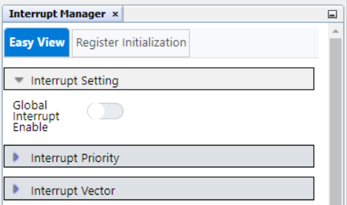
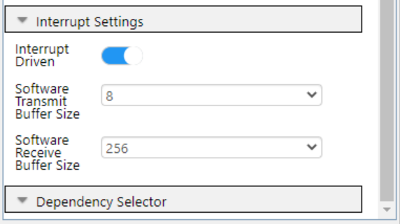

 
 
# Timer/Counter Type F (TCF) – Frequency-shift Keying (FSK) Modulation and Demodulation with TCF and TCB Using the AVR16EB32 Microcontroller with MCC Melody

This project showcases a full duplex communication between two AVR16EB32 Curiosity Nano boards through FSK data modulation and demodulation techniques implemented using timer peripherals. A simplified block diagram of the application is featured below, illustrating the peripherals used for each process.

 

Binary FSK (BFSK) is a digital modulation technique that involves shifting the carrier signal between two discrete frequencies to transmit digital information.

 

Data input is provided by the user from the serial terminal using the Universal Synchronous and Asynchronous Receiver and Transmitter (USART) peripheral. The Timer/Counter type F (TCF) is configured in NCO Fixed Duty-Cycle mode and is used to generate the two FSK frequencies. The Timer/Counter type E (TCE) is configured in Normal mode and generates periodic interrupts used to modulate the data. By altering the increment value of the TCF, the frequency of the output waveform is shifted between the two values according to the state of the bit that is modulated.

 

The demodulation process is implemented using two instances of the TCB peripheral. The first TCB instance, operating in Input Capture Frequency Measurement mode, is used to distinguish between the two FSK frequencies and update a state variable accordingly. The received modulated signal is fed to the TCB input channel using the Event System. The second TCB instance is operating in Periodic Interrupt mode and is used to sample the state variable and reconstruct the data. The demodulated data is displayed in the serial terminal window.

 

## Related Documentation

- [AVR16EB32 Data Sheet](https://ww1.microchip.com/downloads/aemDocuments/documents/MCU08/ProductDocuments/DataSheets/AVR16EB14_20_28_32-Prelim-DataSheet-DS40002522.pdf)
- [AVR16EB32 Product Page](https://www.microchip.com/en-us/product/AVR16EB32)

## Software Used

- [MPLAB® X IDE](http://www.microchip.com/mplab/mplab-x-ide) v6.15 or newer
- [MPLAB® XC8](http://www.microchip.com/mplab/compilers) v2.45 or newer
- [AVR-Ex_DFP](https://packs.download.microchip.com/) v2.8.189 or newer

## Hardware Used

- 2x [AVR16EB32 Curiosity Nano](https://www.microchip.com/en-us/development-tool/EV73J36A) development boards are used as test platforms:
 

- 2x [Curiosity Nano Base for Click Boards™](https://www.microchip.com/en-us/development-tool/AC164162):
   

## Operation

To program the Curiosity Nano boards with this MPLAB X project, follow the steps provided in the [How to Program the Curiosity Nano Board](#how-to-program-the-curiosity-nano-board) chapter.  

## Setup

The following configurations must be made for this project:

- Configuration bits:
  - High-frequency Oscillator Frequency: 20 MHz
  - Watchdog Timeout Period: Watchdog timer off

   

- Clock Control:
  - Clock select: Internal high-frequency oscillator
  - Prescaler enable: No

   

- Interrupt Manager:
  - Global Interrupt Enable: No

   
   

- USART0:
  - Enable USART Receiver: Yes
  - Enable USART Transmitter: Yes
  - Receive Interrupt Enable: Yes
  - Transmit Interrupt Enable: Yes
  - Requested Baudrate: 1200
  - Parity: None
  - Data Size: 8
  - Stop Bits: 1
  - Interrupt Driven: Yes
  - Software Transmit Buffer Size: 8
  - Software Receive Buffer Size: 256

   
   
   

- TCF0:
  - Timer Enable: No
  - Clock Source Select: CLKPER
  - Clock Prescaler: DIV1
  - Waveform Generation Mode: NCOFDC
  - Requested Period: 0.00025s
  - Waveform Output 0 Enable: Yes
  - Waveform Output 0 Polarity: NORMAL
  - Generate ISR: No
  - Compare 0 Event Generation: WAVEFORM

   
   
   

- TCE0:
  - Module Enable: No
  - Clock Selection: DIV8
  - Direction: UP
  - Waveform generation mode: NORMAL
  - Requested Period: 0.001s
  - Generate ISR: Yes
  - Overflow Interrupt Enable: Yes

   
   
   

- TCB0:
  - Enable Timer: Yes
  - Clock Selection: DIV1
  - Counter Size: 16BITS
  - Timer Mode: FRQ
  - Enable Event Input Capture: Yes
  - Generate ISR: Yes
  - Enable Capture/Timeout Interrupt: Yes
  
   
   

- TCB1:
  - Enable Timer: Yes
  - Clock Selection: DIV1
  - Counter Size: 16BITS
  - Timer Mode: INT
  - Requested Timeout: 0.000025s
  - Generate ISR: Yes
  - Enable Capture/Timeout Interrupt: Yes
  
   
   

- Event System:
  - Generator: PORTA_EV0 (PA1)
  - Channel: CHANNEL0
  - User: TCB0CAPT

   

| Pin | Configuration  |          Description         |
| :-: | :------------: | :--------------------------: |
| PC1 | Digital output |          USART0 TXD          |
| PC2 | Digital input  |          USART0 RXD          |
| PA0 | Digital output |   TCF0 WO0 (modulated data)  |
| PA1 | Digital input  |  TCB0 input capture channel  |
| PA2 | Digital output |Binary data that is modulated |
| PA3 | Digital output | TCB0 capture interrupt event |
| PA4 | Digital output | TCB1 capture interrupt event |
| PA5 | Digital output |    Demodulated binary data   |
| PA6 | Digital output |Toggle on TCE0 interrupt event|

**Note:** Only PC1, PC2, PA0 and PA1 are actually needed for the application. The rest of the pins are used to observe the modulation and demodulation processes.

   
   

The Xplained Pro Extension header on the Curiosity Nano Base is used to connect the two AVR16EB32 Curiosity Nano boards.
 

## Demo

Hardware setup:
 

Logic analyzer captures:
  - Modulation process:
   
   
  - Demodulation process:
   
   
  - Full duplex communication:
   
   

Serial terminal windows:
 

The two Curiosity Nano boards are connected to the same laptop/PC in this case. The low-side window displays the text that was typed in the top-side window and vice-versa.

## Summary

This code example demonstrates how to implement a full duplex communication through FSK modulation and demodulation using the TCF, TCE and TCB peripherals.

##  How to Program the Curiosity Nano board

This chapter shows how to use the MPLAB X IDE to program an AVR device with an `Example_Project.X`. This can be applied for any other projects. 

1. Connect the board to the PC.

2. Open the `Example_Project.X` project in MPLAB X IDE.

3. Set the `Example_Project.X` project as main project:
   Right click the project in the **Projects** tab and click Set as Main Project.
   

4. Clean and build the `Example_Project.X` project:
   Right click the `Example_Project.X` project and select Clean and Build.
   

5. Select AVRxxxxx Curiosity Nano in the Connected Hardware Tool section of the project settings:
   Right click the project and click Properties.
   Click the arrow under the Connected Hardware Tool.
   Select the AVRxxxxx Curiosity Nano by clicking on the SN.
   Click **Apply** and then **OK**.
   

6. Program the project to the board:
   Right click the project and then Make and Program Device.
   

 

- [Back to Top](#timercounter-type-f-tcf-–-frequency-shift-keying-fsk-modulation-and-demodulation-with-tcf-and-tcb-using-the-avr16eb32-microcontroller-with-mcc-melody)
- [Back to Setup](#setup)
- [Back to Demo](#demo)
- [Back to Summary](#summary)
